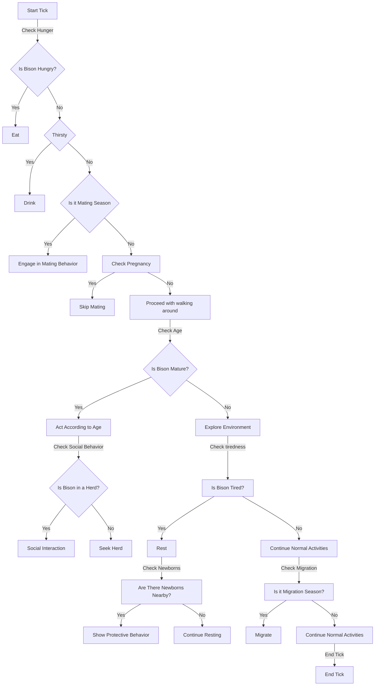

```mermaid
flowchart TD

  A[Start Tick] -->|Check Hunger| B{Is Bison Hungry?}
  B -->|Yes| C[Eat]
  B -->|No| D{Thirsty}

  D -->|Yes| E[Drink]
  D -->|No| F{Is it Mating Season}

  F -->|Yes| G[Engage in Mating Behavior]
  F -->|No| H[Check Pregnancy]

  H -->|Yes| I[Skip Mating]
  H -->|No| J[Proceed with walking around]
  

  J -->|Check Age| K{Is Bison Mature?}
  K -->|Yes| L[Act According to Age]
  K -->|No| M[Explore Environment]

  L -->|Check Social Behavior| N{Is Bison in a Herd?}
  N -->|Yes| O[Social Interaction]
  N -->|No| P[Seek Herd]

  M -->|Check tiredness| T[Is Bison Tired?]
  T -->|Yes| U[Rest]
  T -->|No| V[Continue Normal Activities]

  U -->|Check Newborns| W[Are There Newborns Nearby?]
  W -->|Yes| X[Show Protective Behavior]
  W -->|No| Y[Continue Resting]

  V -->|Check Migration| Z[Is it Migration Season?]
  Z -->|Yes| AA[Migrate]
  Z -->|No| AB[Continue Normal Activities]

  AB -->|End Tick| AC[End Tick]
```
