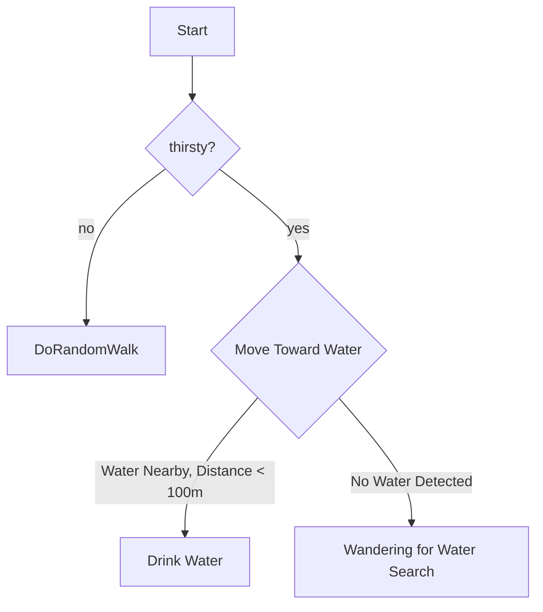
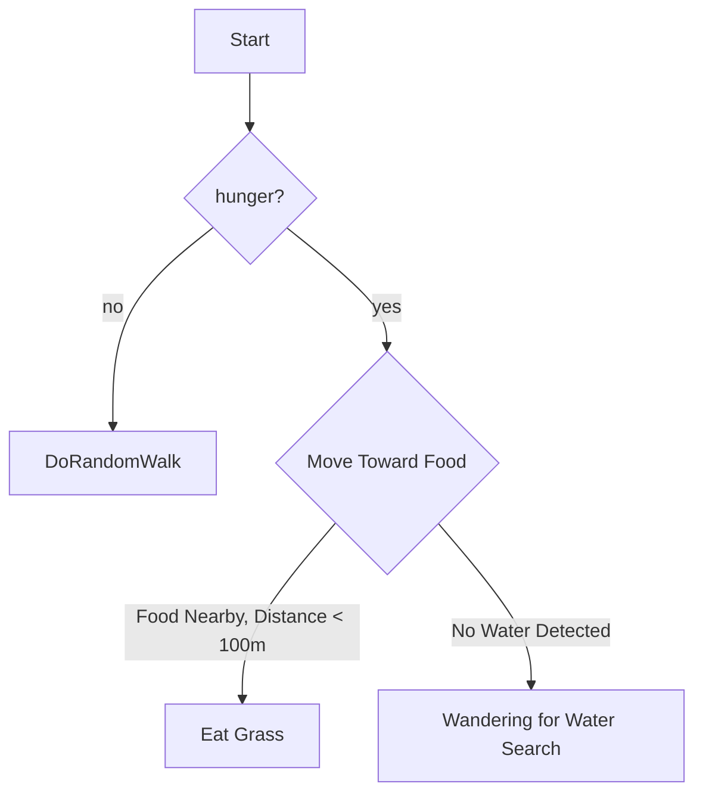
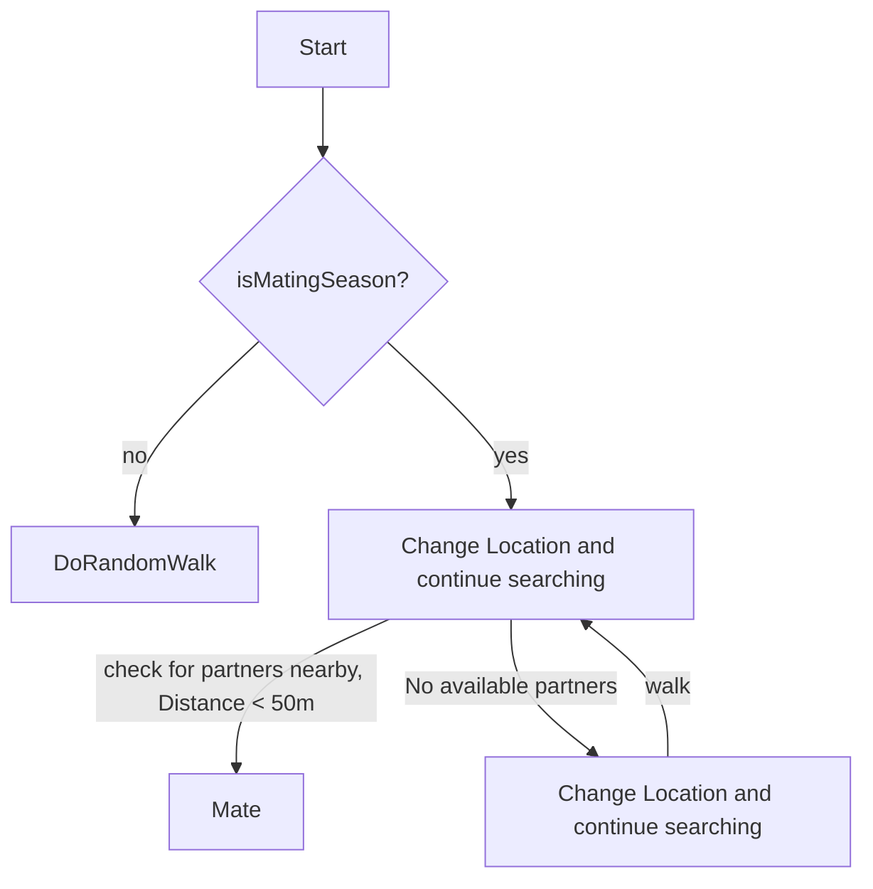

```mermaid
flowchart TD
  A[Start]--> I{thirsty?}
  I -->|no| J[DoRandomWalk]
  I -->|yes| D{Move Toward Water}
  D -->|Water Nearby, Distance < 100m| E[Drink Water]
  D -->|No Water Detected| Q[Wandering for Water Search]

```
#

```mermaid
flowchart TD
  A[Start]--> I{hunger?}
  I -->|no| J[DoRandomWalk]
  I -->|yes| D{Move Toward Food}
  D -->|Food Nearby, Distance < 100m| E[Eat Grass]
  D -->|No Water Detected| Q[Wandering for Water Search]

```
#

```mermaid
flowchart TD
  A[Start]--> I{isMatingSeason?}
  I -->|no| J[DoRandomWalk]
  I -->|yes| D{Search partner for mating}
  D -->|check for partners nearby, Distance < 50m| E[Mate]
  D -->|No available partners| Q[Change Location and continue searching]
  Q -->|walk| D[Change Location and continue searching]

```