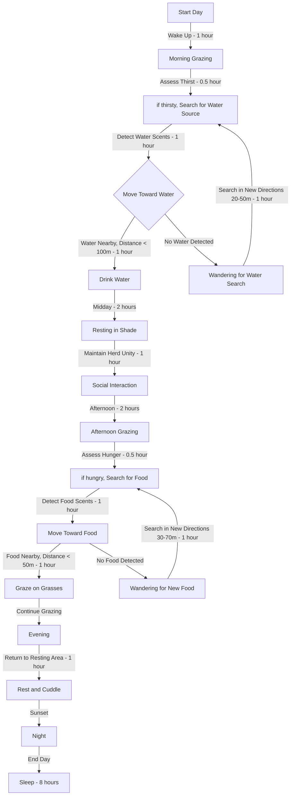
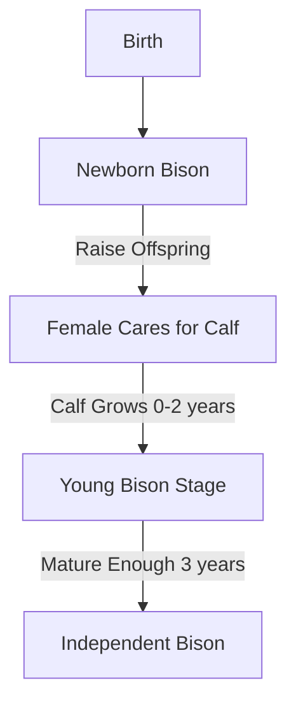

```mermaid
flowchart TD
    A[Start Day] -->|Wake Up - 1 hour| B[Morning Grazing]
    B -->|Assess Thirst - 0.5 hour| C[if thirsty, Search for Water Source]

    C -->|Detect Water Scents - 1 hour| D{Move Toward Water}
    D -->|Water Nearby, Distance < 100m - 1 hour| E[Drink Water]
    D -->|No Water Detected| Q[Wandering for Water Search]

    E -->|Midday - 2 hours| F[Resting in Shade]
    F -->|Maintain Herd Unity - 1 hour| G[Social Interaction]

    G -->|Afternoon - 2 hours| H[Afternoon Grazing]
    H -->|Assess Hunger - 0.5 hour| I[if hungry, Search for Food]
    I -->|Detect Food Scents - 1 hour| J[Move Toward Food]
    J -->|Food Nearby, Distance < 50m - 1 hour| K[Graze on Grasses]
    J -->|No Food Detected| R[Wandering for New Food]
    K -->|Continue Grazing| L[Evening]
    
    L -->|Return to Resting Area - 1 hour| M[Rest and Cuddle]
    M -->|Sunset| N[Night]
    N -->|End Day| P[Sleep - 8 hours]

    Q -->|Search in New Directions 20-50m - 1 hour| C
    R -->|Search in New Directions 30-70m - 1 hour| I


```

```mermaid
flowchart TD
  A[Birth]--> I[Newborn Bison]

  I -->|Raise Offspring| J[Female Cares for Calf]
  J -->|Calf Grows 0-2 years| K[Young Bison Stage]
  K -->|Mature Enough 3 years| L[Independent Bison]


```