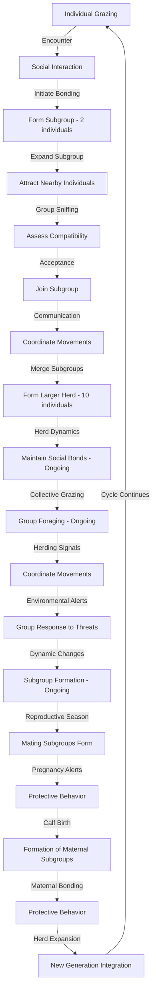
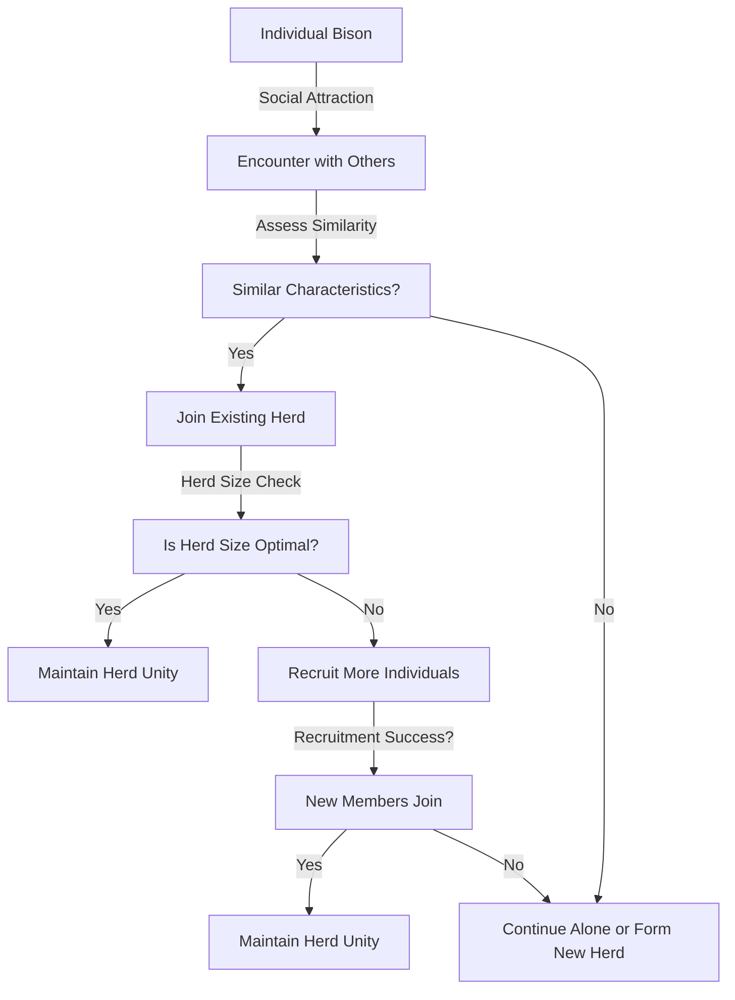

```mermaid
flowchart TD
    A[Individual Grazing] -->|Encounter| B[Social Interaction]
    B -->|Initiate Bonding| C[Form Subgroup - 2 individuals]
    C -->|Expand Subgroup| D[Attract Nearby Individuals]
    D -->|Group Sniffing| E[Assess Compatibility]
    E -->|Acceptance| F[Join Subgroup]
    F -->|Communication| G[Coordinate Movements]
    G -->|Merge Subgroups| H[Form Larger Herd - 10 individuals]

    H -->|Herd Dynamics| I[Maintain Social Bonds - Ongoing]
    I -->|Collective Grazing| J[Group Foraging - Ongoing]
    J -->|Herding Signals| K[Coordinate Movements]
    K -->|Environmental Alerts| L[Group Response to Threats]

    L -->|Dynamic Changes| M[Subgroup Formation - Ongoing]
    M -->|Reproductive Season| N[Mating Subgroups Form]
    N -->|Pregnancy Alerts| O[Protective Behavior]

    O -->|Calf Birth| P[Formation of Maternal Subgroups]
    P -->|Maternal Bonding| Q[Protective Behavior]
    Q -->|Herd Expansion| R[New Generation Integration]
    R -->|Cycle Continues| A

```

#

```mermaid
flowchart TD
    A[Individual Bison] -->|Social Attraction| B[Encounter with Others]
    B -->|Assess Similarity| C[Similar Characteristics?]
    C -->|Yes| D[Join Existing Herd]
    C -->|No| E[Continue Alone or Form New Herd]

    D -->|Herd Size Check| F[Is Herd Size Optimal?]
    F -->|Yes| G[Maintain Herd Unity]
    F -->|No| H[Recruit More Individuals]

    H -->|Recruitment Success?| I[New Members Join]
    I -->|Yes| J[Maintain Herd Unity]
    I -->|No| E[Continue Alone or Form New Herd]

```