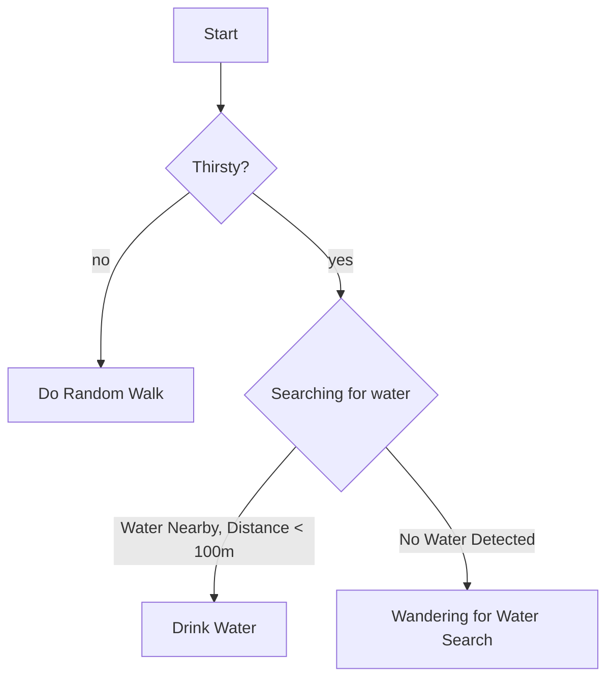
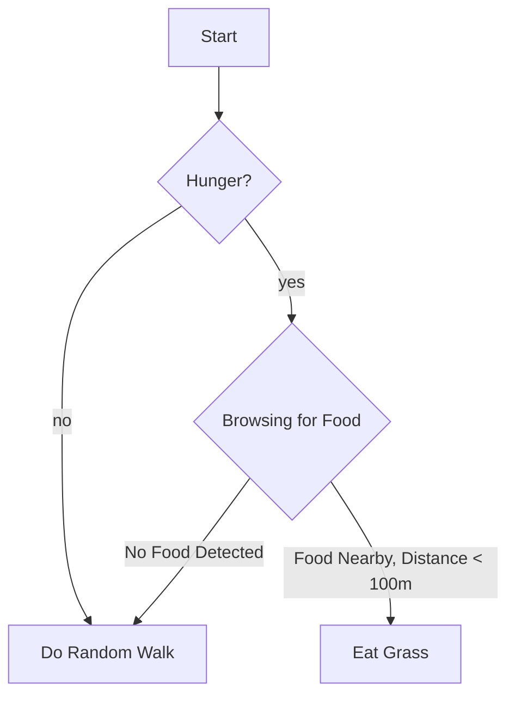
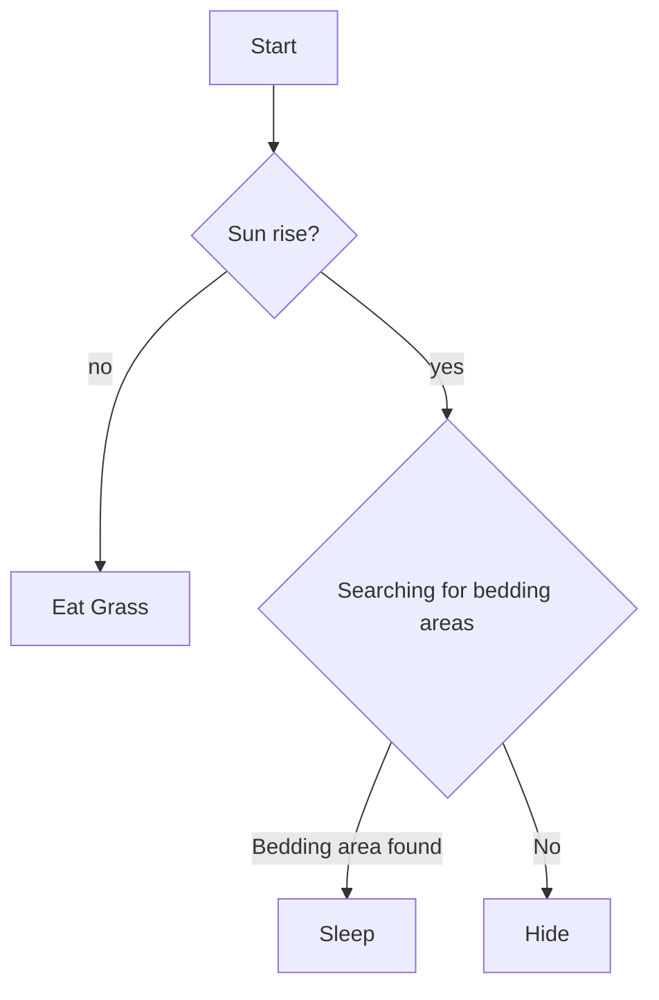

```mermaid
flowchart TD
    A[Start]--> B{Thirsty?}
    B -->|no| D[Do Random Walk]
    B -->|yes| C{Searching for water}
    C -->|Water Nearby, Distance < 100m| E[Drink Water]
    C -->|No Water Detected| F[Wandering for Water Search]
```

```mermaid
flowchart TD
    A[Start]--> B{Hunger?}
    B -->|no| D[Do Random Walk]
    B -->|yes| C{Browsing for Food}
    C -->|Food Nearby, Distance < 100m| E[Eat Grass]
    C -->|No Food Detected| D
```

```mermaid
flowchart TD
    A[Start]--> B{Sun rise?}
    B -->|no| D[Eat Grass]
    B -->|yes| C{Searching for bedding areas}
    C -->|Bedding area found| E[Sleep]
    C -->|No| F[Hide]
```