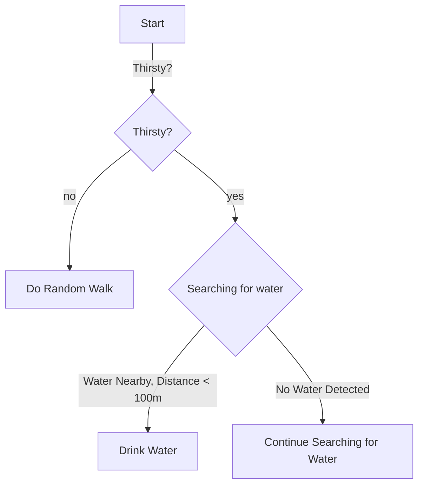
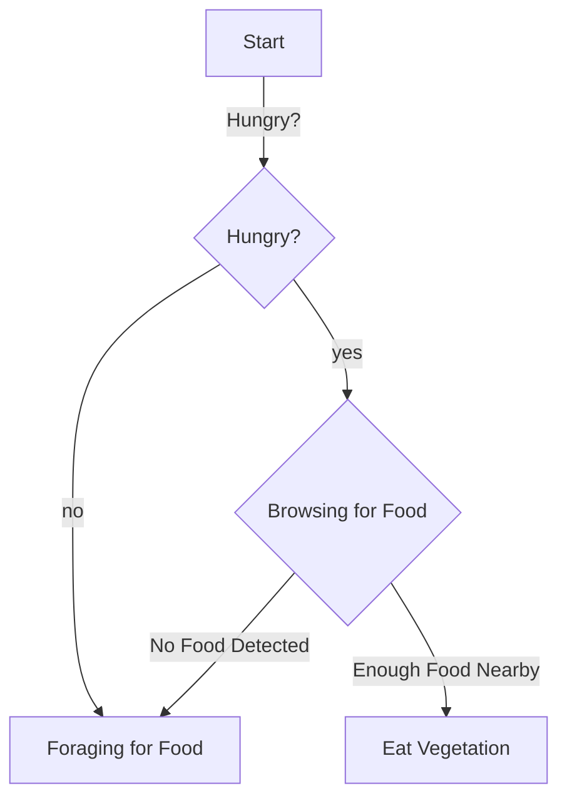
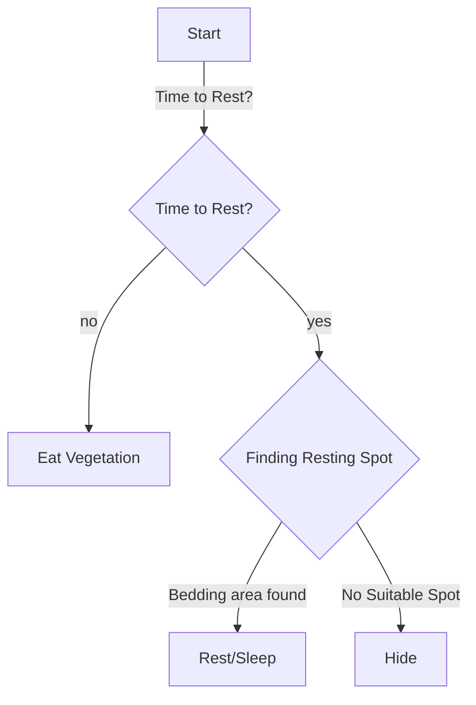
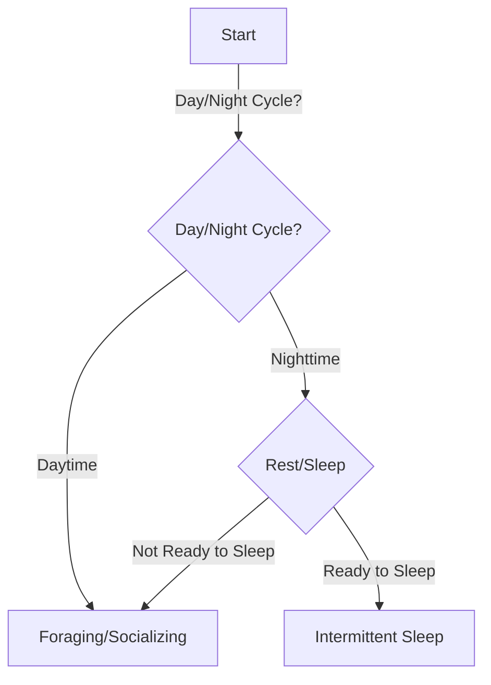
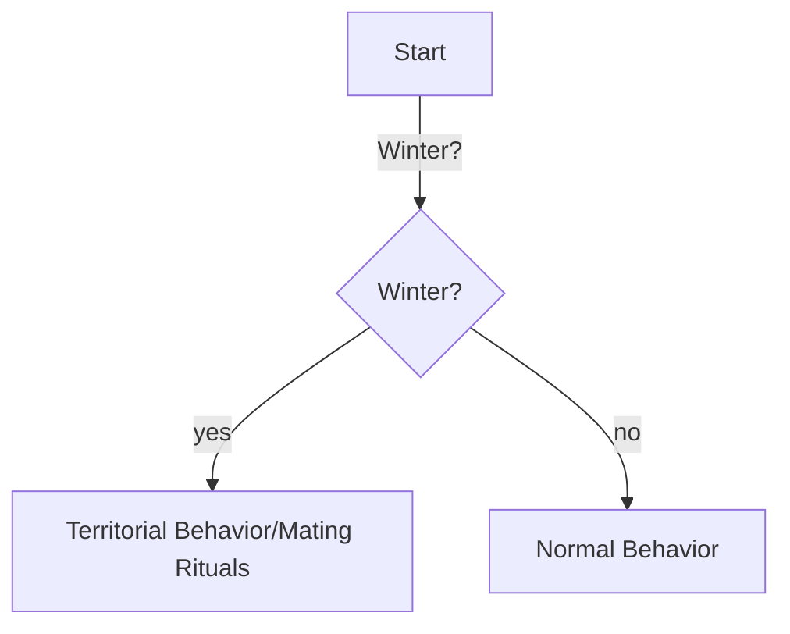
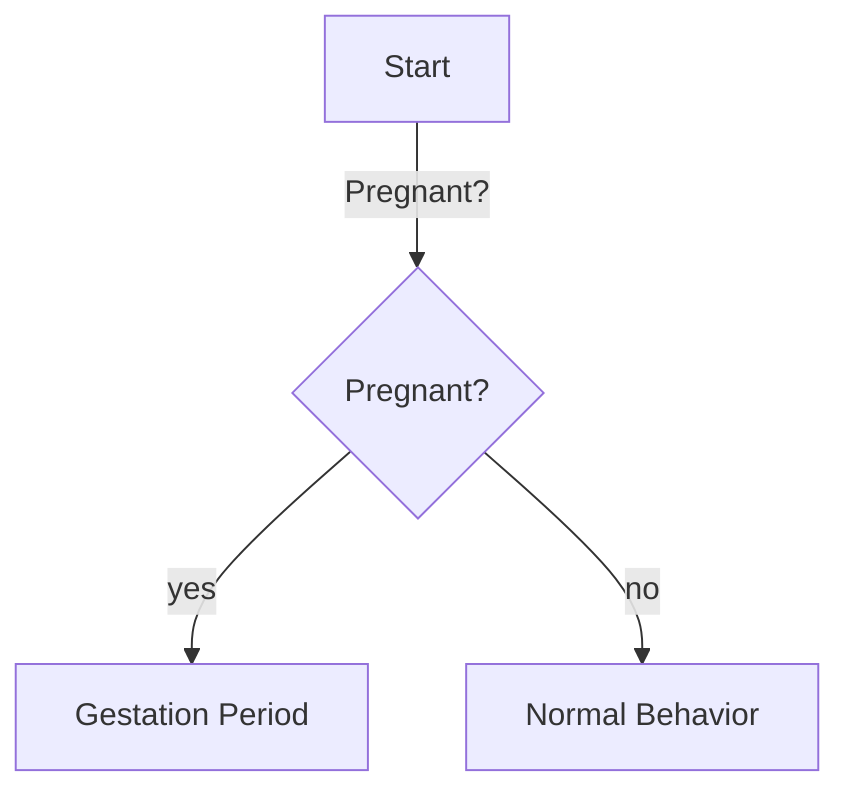

```mermaid
flowchart TD
    A[Start]--> |Thirsty?| B{Thirsty?}
    B -->|no| D[Do Random Walk]
    B -->|yes| C{Searching for water}
    C -->|Water Nearby, Distance < 100m| E[Drink Water]
    C -->|No Water Detected| F[Continue Searching for Water]
```

```mermaid
flowchart TD
    A[Start]--> |Hungry?| B{Hungry?}
    B -->|no| D[Foraging for Food]
    B -->|yes| C{Browsing for Food}
    C -->|Enough Food Nearby| E[Eat Vegetation]
    C -->|No Food Detected| D
```

```mermaid
flowchart TD
    A[Start]-->|Time to Rest?| B{Time to Rest?}
    B -->|no| C[Eat Vegetation]
    B -->|yes| D{Finding Resting Spot}
    D -->|Bedding area found| E[Rest/Sleep]
    D -->|No Suitable Spot| F[Hide]
```

```mermaid
flowchart TD
    A[Start]-->|Day/Night Cycle?| B{Day/Night Cycle?}
    B -->|Daytime| C[Foraging/Socializing]
    B -->|Nighttime| D{Rest/Sleep}
    D -->|Ready to Sleep| E[Intermittent Sleep]
    D -->|Not Ready to Sleep| C
```

```mermaid
flowchart TD
    A[Start]-->|Winter?| B{Winter?}
    B -->|yes| C[Territorial Behavior/Mating Rituals]
    B -->|no| D[Normal Behavior]
```

```mermaid
flowchart TD
    A[Start]-->|Pregnant?| B{Pregnant?}
    B -->|yes| C[Gestation Period]
    B -->|no| D[Normal Behavior]
```