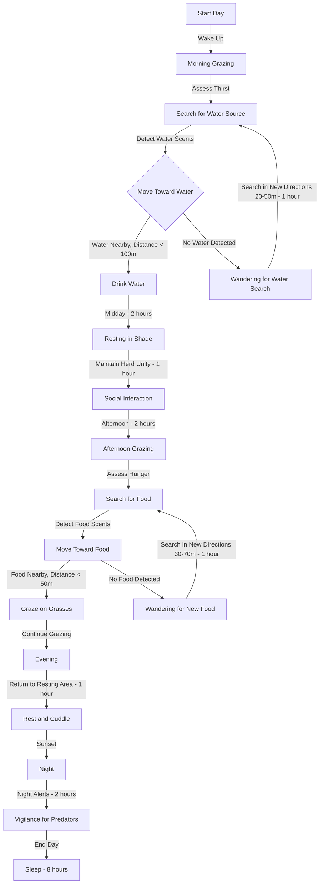
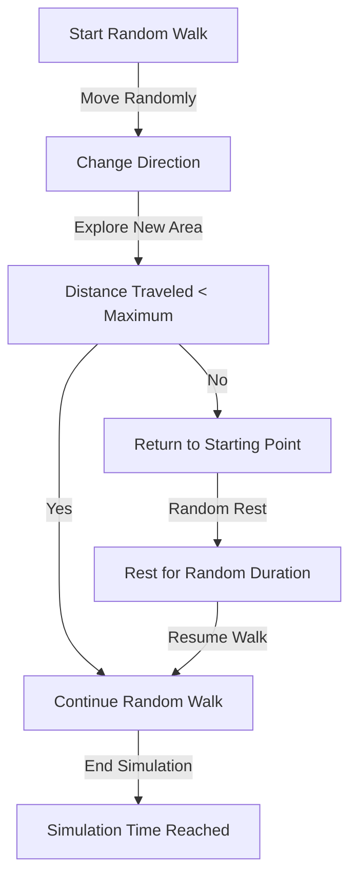
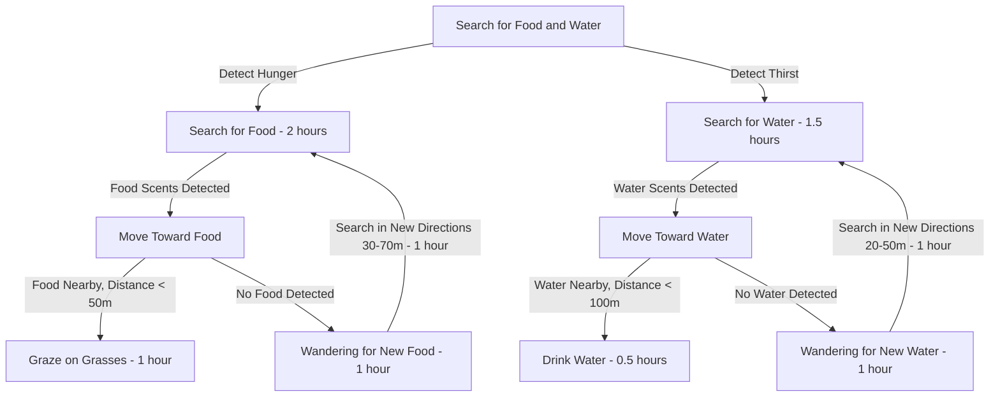
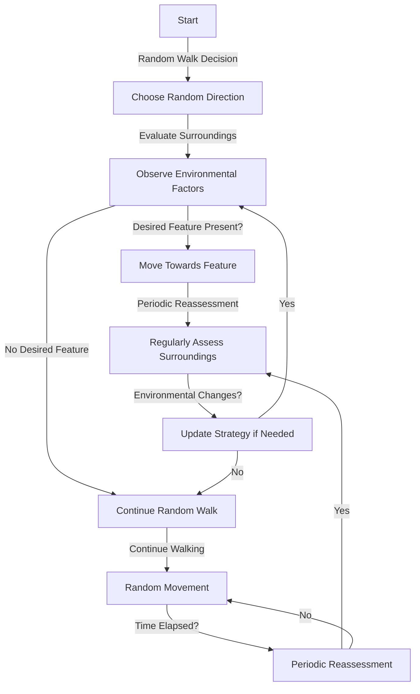

```mermaid
flowchart TD
    A[Start Day] -->|Wake Up| B[Morning Grazing]
    B -->|Assess Thirst| C[Search for Water Source]

    C -->|Detect Water Scents| D{Move Toward Water}
    D -->|Water Nearby, Distance < 100m| E[Drink Water]
    D -->|No Water Detected| Q[Wandering for Water Search]

    E -->|Midday - 2 hours| F[Resting in Shade]
    F -->|Maintain Herd Unity - 1 hour| G[Social Interaction]

    G -->|Afternoon - 2 hours| H[Afternoon Grazing]
    H -->|Assess Hunger| I[Search for Food]
    I -->|Detect Food Scents| J[Move Toward Food]
    J -->|Food Nearby, Distance < 50m| K[Graze on Grasses]
    J -->|No Food Detected| R[Wandering for New Food]

    K -->|Continue Grazing| L[Evening]
    
    L -->|Return to Resting Area - 1 hour| M[Rest and Cuddle]
    M -->|Sunset| N[Night]

    N -->|Night Alerts - 2 hours| O[Vigilance for Predators]
    O -->|End Day| P[Sleep - 8 hours]

    Q -->|Search in New Directions 20-50m - 1 hour| C
    R -->|Search in New Directions 30-70m - 1 hour| I

```
#

```mermaid

flowchart TD
    A[Start Random Walk] -->|Move Randomly| B[Change Direction]
    B -->|Explore New Area| C[Distance Traveled < Maximum]
    C -->|Yes| D[Continue Random Walk]
    C -->|No| E[Return to Starting Point]

    E -->|Random Rest| F[Rest for Random Duration]
    F -->|Resume Walk| D[Continue Random Walk]
    D -->|End Simulation| G[Simulation Time Reached]
```
#

```mermaid
flowchart TD
    A[Search for Food and Water] -->|Detect Hunger| B[Search for Food - 2 hours]
    B -->|Food Scents Detected| C[Move Toward Food]
    C -->|Food Nearby, Distance < 50m| D[Graze on Grasses - 1 hour]
    C -->|No Food Detected| E[Wandering for New Food - 1 hour]

    E -->|Search in New Directions 30-70m - 1 hour| B

    A -->|Detect Thirst| F[Search for Water - 1.5 hours]
    F -->|Water Scents Detected| G[Move Toward Water]
    G -->|Water Nearby, Distance < 100m| H[Drink Water - 0.5 hours]
    G -->|No Water Detected| I[Wandering for New Water - 1 hour]

    I -->|Search in New Directions 20-50m - 1 hour| F
```

#

```mermaid
flowchart TD
    A[Start] -->|Random Walk Decision| B[Choose Random Direction]
    B -->|Evaluate Surroundings| C[Observe Environmental Factors]
    C -->|Desired Feature Present?| D[Move Towards Feature]
    C -->|No Desired Feature| E[Continue Random Walk]

    D -->|Periodic Reassessment| F[Regularly Assess Surroundings]
    F -->|Environmental Changes?| G[Update Strategy if Needed]
    G -->|Yes| C
    G -->|No| E

    E -->|Continue Walking| H[Random Movement]
    H -->|Time Elapsed?| I[Periodic Reassessment]
    I -->|Yes| F
    I -->|No| H
```