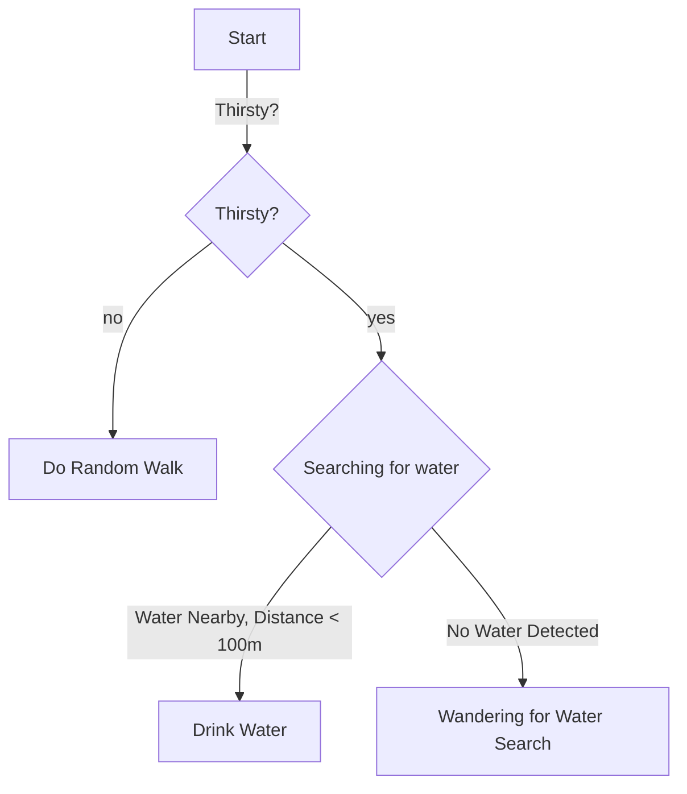
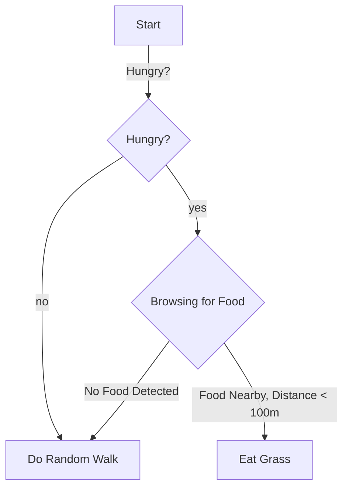
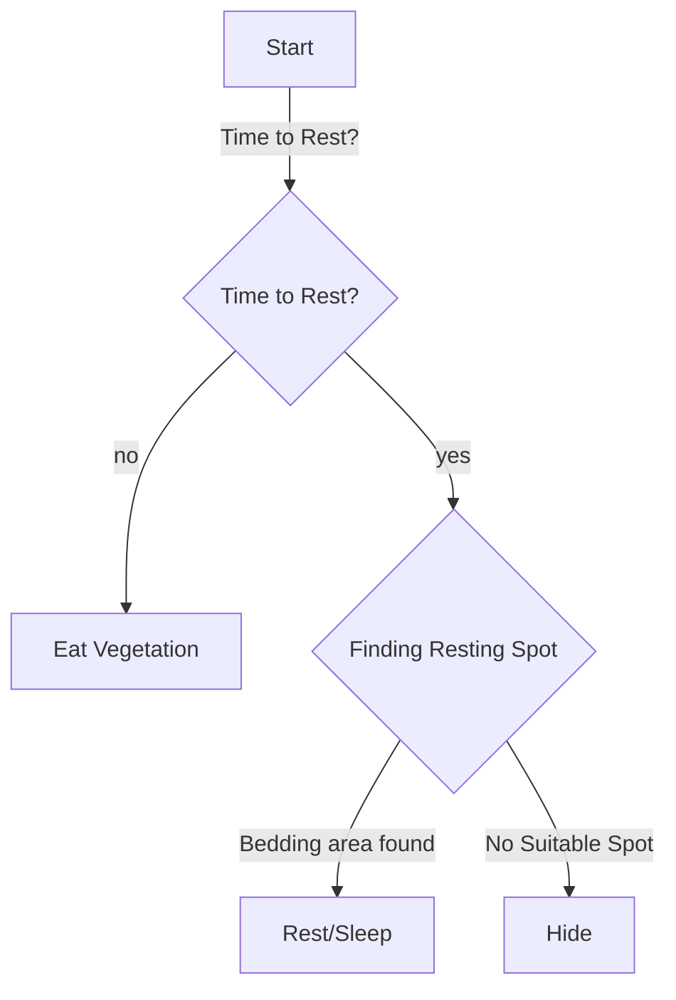
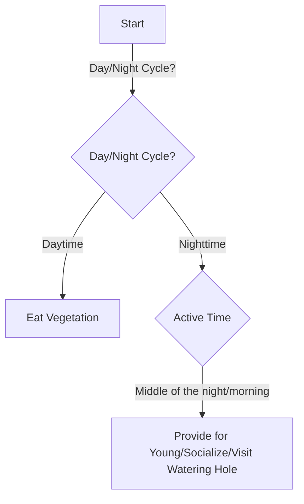
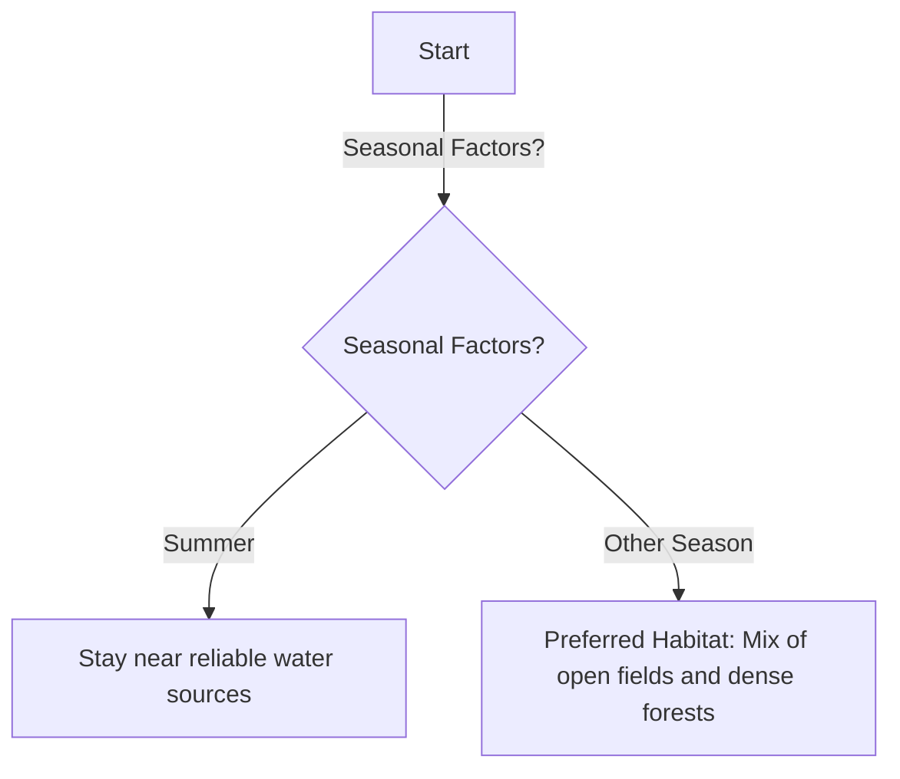

```mermaid
flowchart TD
    A[Start]--> |Thirsty?| B{Thirsty?}
    B -->|no| D[Do Random Walk]
    B -->|yes| C{Searching for water}
    C -->|Water Nearby, Distance < 100m| E[Drink Water]
    C -->|No Water Detected| F[Wandering for Water Search]
```

```mermaid
flowchart TD
    A[Start]--> |Hungry?| B{Hungry?}
    B -->|no| D[Do Random Walk]
    B -->|yes| C{Browsing for Food}
    C -->|Food Nearby, Distance < 100m| E[Eat Grass]
    C -->|No Food Detected| D
```

```mermaid
flowchart TD
    A[Start]-->|Time to Rest?| B{Time to Rest?}
    B -->|no| C[Eat Vegetation]
    B -->|yes| D{Finding Resting Spot}
    D -->|Bedding area found| E[Rest/Sleep]
    D -->|No Suitable Spot| F[Hide]
```

```mermaid
flowchart TD
    A[Start]-->|Day/Night Cycle?| B{Day/Night Cycle?}
    B -->|Daytime| C[Eat Vegetation]
    B -->|Nighttime| D{Active Time}
    D -->|Middle of the night/morning| E[Provide for Young/Socialize/Visit Watering Hole]
```

```mermaid
flowchart TD
    A[Start]-->|Seasonal Factors?| B{Seasonal Factors?}
    B -->|Summer| C[Stay near reliable water sources]
    B -->|Other Season| D[Preferred Habitat: Mix of open fields and dense forests]
```
