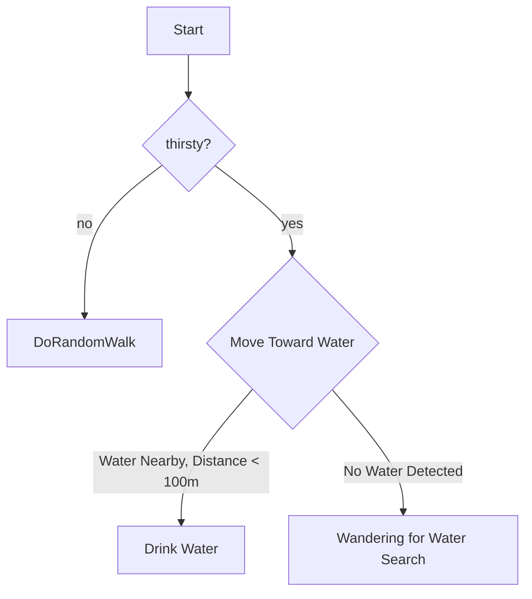
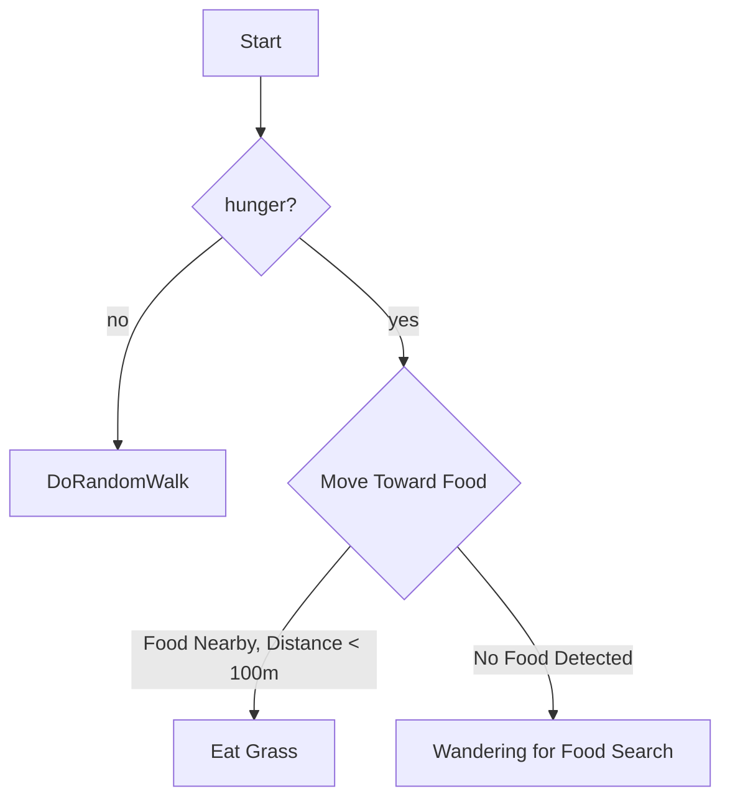
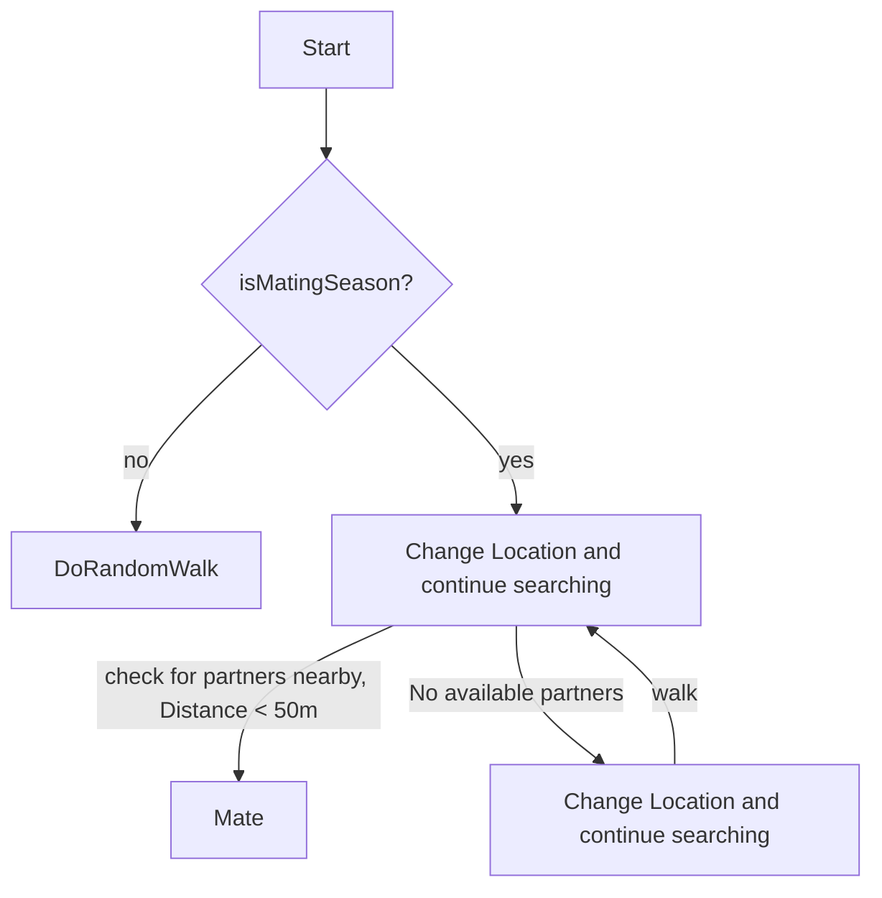
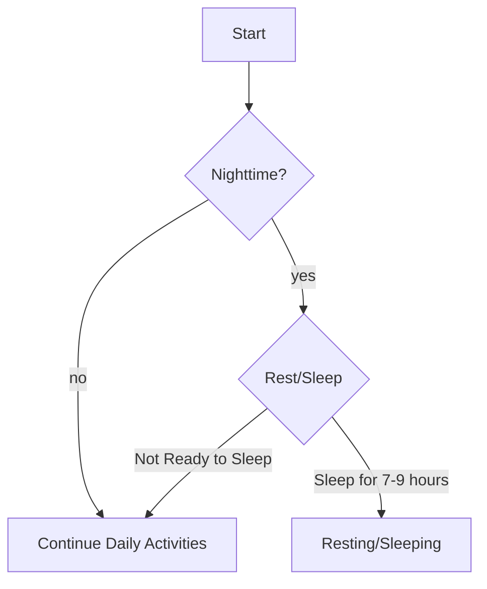
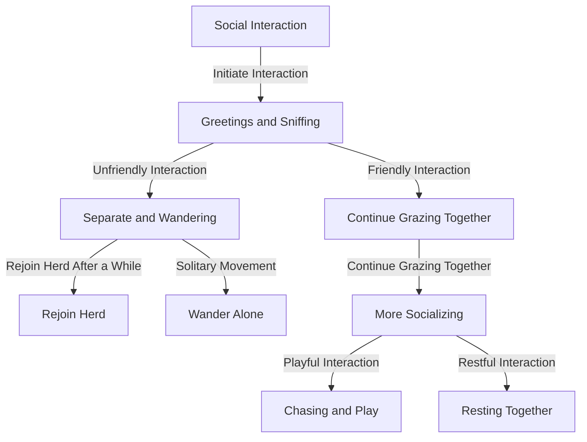

#
# Check during the tick if bison thirsty

#
# Check during the tick if bison is hungry 

#
# Check during the tick if it is mating season

#
# Check during the tick if bison is tired and should get some rest

# 
# Chart for social interaction 
