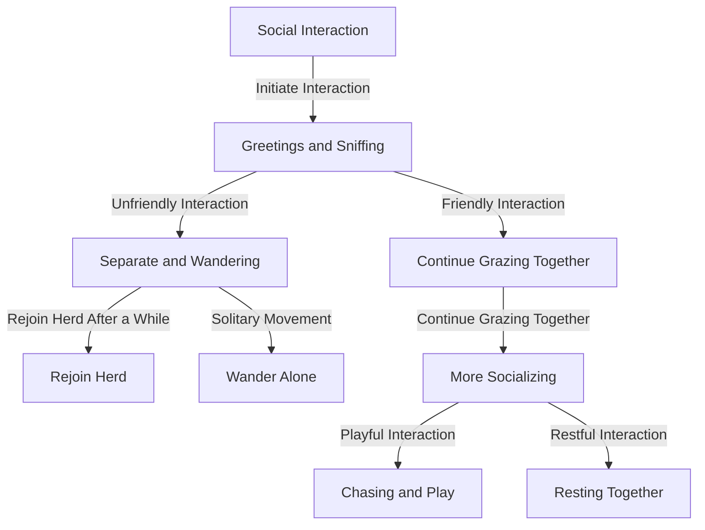

```mermaid
flowchart TD
    A[Social Interaction] -->|Initiate Interaction| B[Greetings and Sniffing]
    B -->|Friendly Interaction| C[Continue Grazing Together]
    B -->|Unfriendly Interaction| D[Separate and Wandering]

    D -->|Rejoin Herd After a While| E[Rejoin Herd]
    D -->|Solitary Movement| F[Wander Alone]

    C -->|Continue Grazing Together| G[More Socializing]

    G -->|Playful Interaction| H[Chasing and Play]
    G -->|Restful Interaction| I[Resting Together]
    
```