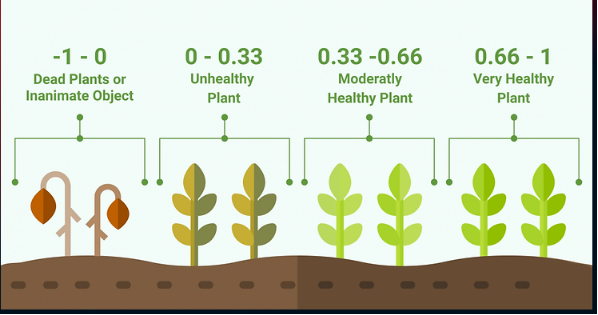
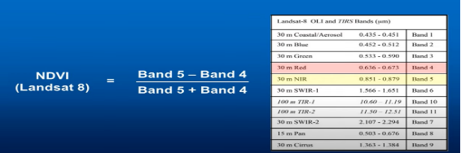

# NDVI

The Normalized Difference Vegetation Index (NDVI) is a simple graphical
indicator that can be used to analyze remote sensing measurements and
assess whether the target area contains live green vegetation or not. It
is calculated from the visible and near-infrared light reflected by
vegetation. NDVI values range from -1 to 1, with higher values
indicating healthier, more dense vegetation.

The formula for NDVI is:

**NDVI = NIR - RED \\ NIR + RED**

where:

- NIR represents the amount of near-infrared light reflected.
- RED represents the amount of red light reflected.

The main purposes of using NDVI include:

1. Vegetation Monitoring: NDVI helps monitor and assess the health, density, and vitality of vegetation over time. It is widely used in agriculture, forestry, and environmental studies to track changes in vegetation cover and health.

2. Ecosystem Analysis: NDVI aids in understanding the dynamics of ecosystems and their responses to environmental changes. It helps ecologists and environmental scientists study the impact of factors like climate change, land use, and natural disasters on vegetation.

3. Crop Health Assessment: Farmers and agronomists use NDVI to assess the health and vigor of crops, identify areas of stress, and make informed decisions about irrigation, fertilization, and pest control.

4. Land Use Planning: NDVI data can inform land use planning and management, providing insights into areas suitable for agriculture, forestry, and conservation efforts. It aids in identifying areas prone to degradation and helps in implementing sustainable land management practices.

5. Climate Change Studies: NDVI is used to monitor and assess the impact of climate change on vegetation patterns and dynamics. It provides valuable information for understanding how ecosystems are responding to shifts in temperature, precipitation, and other climatic factors.

Overall, NDVI is a valuable tool for understanding the state of vegetation and the environment, making it an essential component in various fields, including agriculture, ecology, and environmental management.

# How?

Data Collection: Obtain satellite imagery data that includes the Near-Infrared (NIR) and Red (RED) bands for the area of Elk Island National Park, Canada.

To obtain the NIR and RED values from satellite imagery, you can use image processing tools and libraries to extract these specific bands (in this case **USGS**).

1. Go to <https://earthexplorer.usgs.gov/>
2. In the Search Criteria section click “KML/Shapefile Upload”
3. And then select KML file from your computer, that you already saved or created from <https://www.google.com/maps/d/>
4. After that click “Data Set” Section
5. Click “Landsat” and choose “Landsat Collection 2 Level-1 or Level-2”.
6. And then choose “Landsat 9-9 OLI/TIRS C2 L1 or L2”.
7. And then click “Result”.
8. You can choose the good quality images and download the files (only B4 and B5), we need this for the NDVI formula. (see <https://landsat.gsfc.nasa.gov/satellites/landsat-8/> )

To calculate NDVI:

## Calculating our NDVI raster in QGIS

1. Download QGIS <https://www.qgis.org/en/site/index.html>
2. Continue with your Landsat project, or you can just add your landsat_composite file to a new map.
3. On the Main Menu navigate to Raster \> Raster Calculator. We are now going to put in the NDVI formula!
4. In the Raster Calculator Expression Box type an opening bracket “(“.
5. Double-click “landsat_composite@5” in the Raster Bands Box, this will be added to your expression.
6. Add a minus and then double-click “landsat_composite@B5” to add it to your expression.
7. Add a closing bracket to create “(“landsat_composite@B5” – “landsat_composite@4”)”
8. Add a division sign “/”, and then redo the first part of the formula, but with a plus instead of a minus (this gives you the bottom line of the equation that we showed you earlier)
9. You should end up with: 
   (“landsat_composite@B5” – “landsat_composite@B4”) / 
   (“landsat_composite@B5” + “landsat_composite@B4”)

10. Click the browse button next to “Output layer”.
11. Navigate to your Landsat folder and type “landsat_NDVI” and click the Save button.
12. Then click the OK button. It will take a little time to run, but then a new layer will be added to the QGIS Layers Panel and Map Window!

## Changing the colours of our NDVI plot

You will notice that the plot is in black and white, with white areas being vegetation, grey being bare earth and black being water. These are the default colours, but we can change them if we want to. Let’s make them a bit more suitable!

- Right-click “landsat_NDVI” in your Layers Panel and select “Properties”.
- Click on the Symbology Tab.
- Change “Render type” from “Singleband gray” to “Singleband pseudocolor”.
- Click the small black arrow next to “Color ramp” and then navigate to “All color ramps” and select “RdYlGr”.
- Click the Classify button.
- Click OK.
